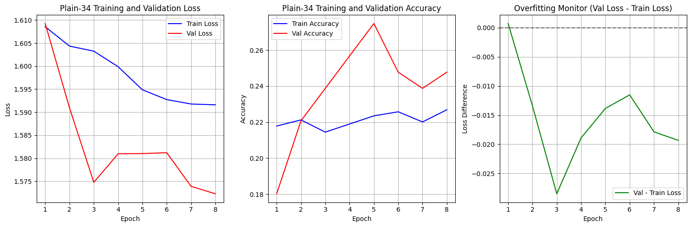

# Eksperimen Arsitektur ResNet34 dan Plain34 - NgodingDiKertas

Source code: https://github.com/jo0707/resnet34

## Informasi

-   Mata Kuliah: IF25-40401 - Deep Learning
-   Program Studi: Teknik Informatika
-   Dosen Pengampu: MCT, IEW, RIK, MCU

Anggota Kelompok:

-   Joshua Palti Sinaga 122140141
-   Rustian Afencius Marbun 122140155

## Dataset

Dataset yang digunakan adalah dataset klasifikasi citra makanan Indonesia dari IF25-40401..

---

## Hasil dan Perbandingan Performa (Epoch Terakhir)

```
================================================================================
FINAL EVALUATION RESULTS - PLAIN-34 BASELINE
================================================================================
Final Validation Metrics:
Accuracy:  0.2748
F1-Score:  0.1729
Precision: 0.1684
Recall:    0.2748
Loss:      1.5810

Detailed Classification Report:
--------------------------------------------------
              precision    recall  f1-score   support

           0       0.00      0.00      0.00        43
           1       0.00      0.00      0.00        41
           2       0.24      0.92      0.38        49
           3       0.46      0.29      0.35        56
           4       0.00      0.00      0.00        33

    accuracy                           0.27       222
   macro avg       0.14      0.24      0.15       222
```

```
================================================================================
FINAL EVALUATION RESULTS - RESNET-34
================================================================================
Final Validation Metrics:
Accuracy:  0.4324
F1-Score:  0.4080
Precision: 0.4519
Recall:    0.4324
Loss:      1.5284

Detailed Classification Report:
--------------------------------------------------
              precision    recall  f1-score   support

           0       0.41      0.60      0.49        43
           1       0.50      0.07      0.13        41
           2       0.34      0.41      0.37        49
           3       0.60      0.59      0.59        56
           4       0.36      0.42      0.39        33

    accuracy                           0.43       222
   macro avg       0.44      0.42      0.39       222
weighted avg       0.45      0.43      0.41       222```
```
---

## Kurva Training (Grafik)

-   ResNet34:

    

-   Plain34:

    

---

## Analisis Singkat

Pada eksperimen ini, penerapan skip connection dilakukan pada kelas `ResNetBlock` (sebelumnya bernama `PlainBlock`) dengan cara menambahkan hasil output (`out`) dengan input aslinya sebelum aktivasi, yaitu `out = out + identity`. 
Hasilnya, ResNet34 menunjukkan performa yang lebih baik dibandingkan PlainNet (tanpa skip connection).

Dari segi performa, PlainNet tanpa residual connection hanya mampu mencapai akurasi validasi sekitar 27%. 
Namun, setelah menerapkan skip connection pada arsitektur ResNet34, terjadi peningkatan akurasi yang signifikan hingga mencapai 43%. Kesimpulannya adalah ResNet34 jauh lebih unggul dibandingkan PlainNet dalam tugas klasifikasi ini.

---